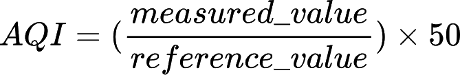

# Air Quality Index (AQI) Integration for Home Assistant


This project provides a Home Assistant integration to retrieve and display real-time Air Quality Index (AQI) data from a monitoring station on the island of Montréal from open data of the Réseau de surveillance de la qualité de l'air (RSQA) [API](https://donnees.montreal.ca/dataset/rsqa-indice-qualite-air/resource/a25fdea2-7e86-42ac-8301-ca77db3ff17e). 

It calculates AQI values based on pollutants (SO2, CO, O3, NO2, PM) and exposes the results as a sensor with attributes for each pollutant level, including the station's timestamp.

List and location of the stations can be found [here](https://donnees.montreal.ca/dataset/rsqa-liste-des-stations/resource/29db5545-89a4-4e4a-9e95-05aa6dc2fd80).

## Features

- Fetch AQI data from a public API ([Montréal’s air quality dataset](https://donnees.montreal.ca/dataset/rsqa-indice-qualite-air/resource/a25fdea2-7e86-42ac-8301-ca77db3ff17e)).
- Display total AQI value and individual pollutant levels as attributes.
- Supports a configurable station ID via Home Assistant's user interface.

## Requirements

- Home Assistant instance.
- Internet connection to fetch real-time AQI data.

## Installation

### Via HACS

[]([https://my.home-assistant.io/redirect/hacs_repository/?owner=Normand+Cyr&repository=https%3A%2F%2Fgithub.com%2Fnormcyr%2Fhome-assistant-montreal-aqi](https://my.home-assistant.io/redirect/hacs_repository/?owner=Normcyr&repository=home-assistant-montreal-aqi&category=integration))

### Manually

#### 1. Download the Repository

Clone this repository.

```bash
git clone https://github.com/yourusername/home-assistant-montreal-aqi.git
```

And copy the folder `custom_components/montreal_aqi` into the `custom_components` folder of your Home Assistant instance.

#### 2. Configuration in Home Assistant

The integration can then be added directly via the Home Assistant UI:

- Go to Configuration > Integrations.
- Search for Montreal AQI and click on it.
- Follow the on-screen instructions to set up the integration by selecting the desired air quality monitoring station (available from the Montréal dataset).

#### 3. Restart Home Assistant

To apply the changes, restart Home Assistant:

```bash
# In the Home Assistant UI:
 Developer tools > Restart
```

## Usage

After installation, the integration will create sensors based on the available air quality data for the selected station.

### Sensors Created

1. AQI Sensor (`sensor.aqi_station_<station_id>`)
  
- Reports the overall Air Quality Index (AQI) value.

2. Air Quality Category Sensor (`sensor.air_quality_category_station_<station_id>`)

- Displays a textual representation of air quality (e.g., "Good", "Acceptable", "Bad").

3. Individual pollutant Sensors (only if data is available)
- Sensors are only created for pollutants that have reported values. Example: `sensor.no2_level_station_<station_id>`

### Dashboard Examples

You can use these sensors in your dashboard with different Lovelace cards. 

For instance, to display AQI as a gauge card and colour it based on the severity:

```yaml
type: gauge
entity: sensor.aqi_station_<station_id>
min: 0
max: 75
severity:
  green: 0
  yellow: 25
  red: 50
```

To display individual pollutants (SO₂ and ozone in this case):

```yaml
type: entities
title: Air Quality Details
entities:
  - entity: sensor.aqi_station_<station_id>
    name: Air Quality Index
  - entity: sensor.air_quality_category_station_<station_id>
    name: Air quality category
  - entity: sensor.so2_level_monitoring_station_<station_id>
    name: Sulfur Dioxide (SO₂)
  - entity: sensor.o3_level_monitoring_station_<station_id>
    name: Ozone (O₃)
```

## Command Line Testing

To test the API locally:

1. Clone the repository to your local machine.
2. Install required dependencies:

```bash
pip install -r requirements.txt
```

3. Run the Python script `test_api.py` found in the `scripts` folder to simulate fetching AQI data and testing the calculations:

```bash
python scripts/test_api.py
```

More details are found in the [README](scripts/README.md) file associated with the script.

### Contributing

We welcome contributions! To contribute:

1. Fork this repository.
2. Create a feature branch (`git checkout -b feature-branch`).
3. Commit your changes (`git commit -am 'Add new feature'`).
4. Push to your branch (`git push origin feature-branch`).
5. Open a pull request.


## Technical Data

### Reference Values for Pollutants

The following table lists the reference values for each pollutant used in calculating the Air Quality Index (AQI) for the station data:

| Pollutant     | Full Name               | Reference Value |
|---------------|-------------------------|-----------------|
| SO₂           | Sulfur Dioxide          | 500 µg/m3       |
| CO            | Carbon Monoxide         | 35 mg/m3        |
| O₃            | Ozone                   | 160 µg/m3       |
| NO₂           | Nitrogen Dioxide        | 400 µg/m3       |
| PM (PM2.5)    | Particulate Matter      | 35 µg/m3        |

### AQI Calculation Method

The AQI for each pollutant is calculated using the following formula, as described [here](https://donnees.montreal.ca/dataset/rsqa-indice-qualite-air#methodology):



where:
- `measured_value` is the concentration of the pollutant in µg/m³ measured at a given time.
- `reference_value` is the predefined reference value for the pollutant (as listed in the table above).
- `AQI` is the calculated air quality index value for that pollutant.

The AQI contribution for each pollutant is calculated individually using the formula, and the total AQI for the station is the sum of the individual pollutant AQIs. The total AQI provides an overall indication of air quality, helping to assess the overall health impact based on the measured pollutants.

The air quality index (AQI) value is defined as follows:

- Good: From 1 to 25
- Acceptable: From 26 to 50
- Poor: 51 or higher

## Licence

This project is licensed under the MIT Licence. See the [LICENCE](LICENCE) file for details.

## Disclaimer

I am not a formally trained programmer, and this project was developed as part of my learning journey. Throughout the process, I have received assistance from ChatGPT, which has helped me improve the code and understand various programming concepts. Any improvements or suggestions to make the code better are more than welcome! Contributions are encouraged and appreciated.
