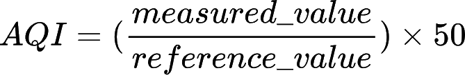

# AQI Monitoring for Montreal

This script fetches air quality data from monitoring stations on the island of Montréal, calculates the Air Quality Index (AQI) based on pollutant concentrations, and provides the results. A similar logic is used for the custom component for Home Assistant.

## Features

- Fetches the latest air quality data from Montreal's open data portal.
- Calculates the AQI contribution for various pollutants.
- Lists available air quality monitoring stations.
- Allows querying specific stations for AQI information.
- Supports debugging with detailed logs.

## Requirements

- Python 3
- `requests` library

You can install the required dependencies using:

```bash
pip install requests
```

## Usage

Run the script with the following options:

### Fetch AQI for a specific station

```bash
python test_api.py --station <station_id>
```

Example:

```bash
python test_api.py --station 1
```

### List available monitoring stations

```bash
python test_api.py --list
```

### Enable debug logging

To enable debug logging for more detailed output, use:

```bash
python test_api.py --debug --station <station_id>
```

### Run interactively

If no station ID is provided, the script will prompt for input:

```bash
python test_api.py
Enter Station ID: <station_id>
```

## Example Output

```
2025-01-31 10:00:00 - INFO - Fetching latest data for station 1...
2025-01-31 10:00:01 - INFO - Found latest data at hour 9.
2025-01-31 10:00:01 - INFO - The air quality index for station 1 is 42.
```

## Logging Levels

- **INFO**: Default mode, displays essential messages.
- **DEBUG**: Provides detailed logs including fetched data and calculations.

## How AQI is Calculated

The contribution of each pollutant to the AQI is calculated using the formula:




where:
- `value` is the measured concentration of the pollutant.
- `ref_value` is the reference concentration for that pollutant.

## Licence

This project is licensed under the MIT License.